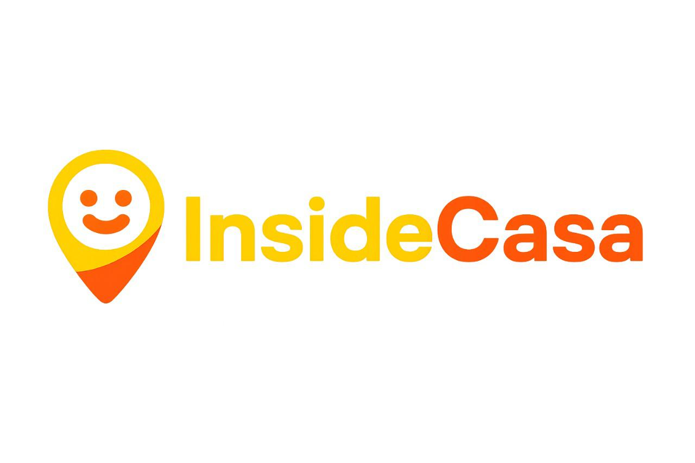

# InsideCasa

  

# Screenshots

# Tags

# Description du projet 

InsideCasa est une plateforme de découverte et de réservation d'activités locales pour la ville de Casablanca. Ce projet vise à offrir aux résidents et aux visiteurs un accès facile à une variété d'activités, d'événements culturels et de restaurants, le tout via une interface simple sur le web et sur mobile.

# Public cible

Concernant les béneficiaires de notre projet nous avons :
- les résidents de casablanca : qui recherchent des idées de sorties et des activités à explorer.
- Les touristes : qui ont besoin d'un guide local numérique pour explorer la ville.
- Les organisateurs d'activités et d'événements : souhaitant mettre en valeur leurs offres.
- Les propriétaires de restaurants : envisageant augmenter leur visibilité.

  
# Fonctionnalités principales 

  1- Pour les utilisateurs concernant la découverte des activités on a :
   * Création de compte et la gestion de profil
   * Navigation intuitive avec des catégories prédéfinies.
   * Flux personnalisé basé sur les préférences de l'utilisateur.
   * Recherche avancée par filtres (date, prix, lieu).
   * Affichage sur carte interactive, géolocalisation pour des options à proximité.
   * Favori en fonction de son utilisation 

  2- Pour la réservation : 
  
   * Calendrier de dispnibilité, historique des réservations
   * Formulaire de réservation plus une confirmation instantanée
   * Intégration de systèmes de paiement sécurisés.
     
  3- Pour les partenaires:
    * Tableau de bord personnalisé : Suivi des réservations et des performances.
    * Gestion des annonces : Création et modification d'activités.
  
# Sécurité
  Authentification sécurisée et protection des données sensibles.
  Validation des entrées pour prévenir les attaques.
  Surveillance, test et maintenance 

# Technologies Utilisées
 Backend : API Node.js avec express
 Frontend : React.js,  flutter 
 Base de données: MySQL
 Sécurité: Chiffrement des données, protection contre les attaques (SQL Injection), HTTPS 
 Paiement : Stripe SDK
 Géolocalisation : API Google Maps

# Défis
- Acquisition et engagement des utilisateurs : Se démarquer dans un marché concurrentiel.
- Acquisition et gestion des partenaires : Convaincre les organisateurs et restaurateurs de rejoindre la plateforme.
- Développement technique : Assurer la scalabilité et la performance de l'application.
- Conformité réglementaire : Respect des lois sur la protection des données

  # Livrables
- Un rapport PDF détaillant :
  - L'adresse de l'application web et mobile.
  - Les choix techniques effectués.
  - Le plan de sécurité mis en place.
  - Le lien vers le répertoire GitHub contenant le code source.

- Une démonstration du travail réalisé lors d'une soutenance.
- 
## Installation

### Prérequis
- Node.js : https://nodejs.org/en/download "LTS" (version recommandée)
- express https://expressjs.com/ 
- MySQL https://dev.mysql.com/downloads/installer/ version : MySQL 8.4.5
- react.js https://react.dev/
- Flutter https://docs.flutter.dev/  version 3.32.0
- Docker [https://nodejs.org/en/download/](https://docs.docker.com)
  
